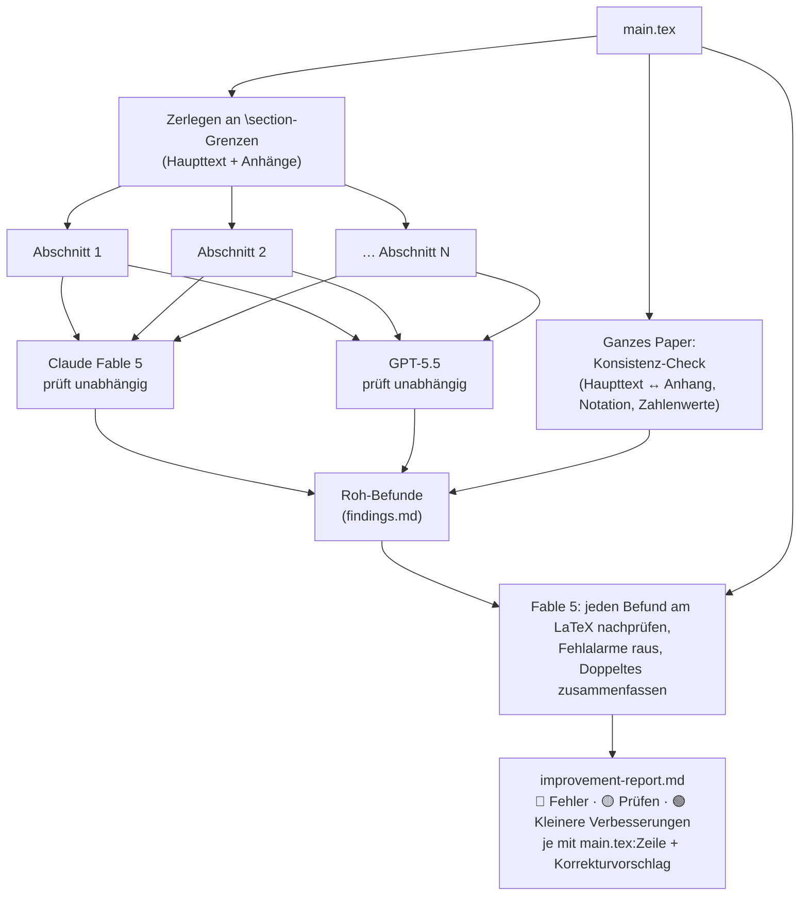

# verify-paper-formulas v2 — Paper-Review mit mehreren KI-Modellen

**Was macht das?** Es liest ein Physik-Paper (LaTeX) Abschnitt für Abschnitt und
lässt **zwei verschiedene Spitzen-KI-Modelle** unabhängig voneinander alles
nachprüfen: Herleitungen nachrechnen, Einheiten, Näherungen, Zahlenwerte,
Vorzeichen, Notation. Ein zusätzlicher Durchgang prüft das ganze Paper auf
Konsistenz (passt der Anhang zum Haupttext? Bedeutet jedes Symbol überall
dasselbe?). Am Ende entsteht **ein Verbesserungs-Report auf Deutsch** — sortiert
nach Wichtigkeit, mit Zeilennummer und konkretem Korrekturvorschlag.

**Das Paper wird nur gelesen, nie verändert.**

> Erstellt von **Lasse Parduhn** für **Prof. Dieter Süß** (Universität Wien),
> ursprünglich für das `energy_harvesting`-Paper. Funktioniert mit jedem
> LaTeX-Paper, das `\section`-Überschriften hat.

---

## Was man braucht

1. **Einen OpenRouter-Schlüssel** ([openrouter.ai](https://openrouter.ai) →
   Keys). Über OpenRouter laufen alle KI-Abfragen; ein Lauf kostet je nach
   Paperlänge etwa **4–8 €**.
2. **Ein Terminal** mit `git`, `curl`, `jq` und `bash` (auf dem Mac alles schon
   da; unter Linux ggf. `sudo apt install jq`).
3. Das Paper als `.tex`-Datei (lokal oder als Overleaf-Git-Clone).

## Einrichten (einmalig)

```bash
# 1. Dieses Repo holen
git clone https://github.com/Lassemind/verify-paper-formulas-v2.git
cd verify-paper-formulas-v2

# 2. Schlüssel eintragen
cp .env.example .env
# .env öffnen und den OpenRouter-Schlüssel einsetzen:
# OPENROUTER_API_KEY=sk-or-...
```

Der Schlüssel bleibt in der `.env` auf dem eigenen Rechner — er wird nie
committed, nie in Reports oder Logs geschrieben.

## Benutzen

```bash
scripts/review_sections.sh /pfad/zum/paper/main.tex ./review-ergebnis
```

Das war's. Der Lauf dauert **15–20 Minuten** (alle Abschnitte werden parallel
geprüft). Danach liegt im Ordner `review-ergebnis`:

| Datei | Inhalt |
|---|---|
| **`improvement-report.md`** | **Der Report** — das, was man liest. Deutsch, drei Kategorien: 🔴 Fehler (muss korrigiert werden), 🟡 Prüfen (Autor muss entscheiden), 🟢 Kleinere Verbesserungen. Jeder Punkt mit `main.tex:Zeile` und Korrekturvorschlag. |
| `findings.md` | Die Roh-Befunde der einzelnen Modelle (Audit-Trail, falls man nachschauen will, wer was gefunden hat). |
| `findings/*.json` | Die unveränderten Modell-Antworten. |

**Bricht ein Lauf ab oder schlagen einzelne Abfragen fehl?** Einfach denselben
Befehl noch einmal ausführen — fertige Ergebnisse werden übersprungen, nur die
Lücken werden nachgeholt.

## Ablauf auf einen Blick



## Wie es intern funktioniert (1 Absatz)

Das Paper wird an den `\section`-Grenzen zerlegt. Jeden Abschnitt prüfen
**Claude Fable 5** (Anthropic) und **GPT-5.5** (OpenAI) unabhängig — zwei
Modelle verschiedener Hersteller, damit sich Fehler nicht gegenseitig
bestätigen. Ein weiterer Durchgang sieht das ganze Paper auf einmal und prüft
abschnittsübergreifende Konsistenz. Zum Schluss prüft Fable 5 jeden einzelnen
Roh-Befund noch einmal am LaTeX nach, wirft Fehlalarme raus, fasst Doppeltes
zusammen und schreibt den deutschen Report.

## Häufige Fragen

**Kostet ein erneuter Lauf wieder voll?** Ja — aber abgebrochene Läufe setzen
gratis dort fort, wo sie waren.

**Kann ich andere Modelle nehmen?**
`REVIEW_MODELS="modell1,modell2" scripts/review_sections.sh …`
(OpenRouter-Modellnamen, kommagetrennt).

**Es kommt `no OPENROUTER_API_KEY found`?** Die `.env` liegt nicht im
Repo-Ordner oder der Schlüssel fehlt darin. Alternativ funktioniert auch
`~/.config/openrouter.env`.

**Eine einzelne Formel ganz tief prüfen?** Dafür gibt es den
Claim-Modus (`scripts/run_claim.sh`) — drei Modelle leiten die Formel von Grund
auf neu her und versuchen anschließend, sie zu widerlegen; Zahlenwerte werden
mit echtem Python nachgerechnet. Details in `SKILL.md`.

**Nutzt das Claude Code?** Es läuft als eigenständiges Kommandozeilen-Tool auf
jedem Rechner. Wer [Claude Code](https://claude.com/claude-code) benutzt, kann
das Repo zusätzlich als Skill nach `~/.claude/skills/` legen — dann genügt
„prüf das Paper" im Chat.
