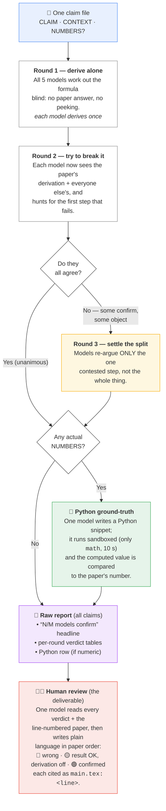

# verify-paper-formulas

**Catch mistakes in a physics paper's formulas before a reviewer does.**

This is a [Claude Code](https://claude.com/claude-code) **skill** that double-checks
the formulas and derivations in a paper. It hands each formula to **five different
AI models** (via [OpenRouter](https://openrouter.ai)) and makes them work it out
*from scratch*, then **argue against each other** to surface any error. Formulas
with numbers in them are checked with a **real calculator** (Python), not the AI's
own arithmetic. Out comes a **plain-language review** — written for a human, in
paper order, telling you exactly which formula is wrong and why — backed by the
full per-formula verdict tables. **Your paper is only read, never edited.**

👉 New here? Jump to **[The idea, in plain words](#the-idea-in-plain-words)**.

> Built by **Lasse Parduhn** for **Prof. Dieter Süß** (University of Vienna) to
> cross-check the derivations in the `energy_harvesting` paper — independently
> re-deriving each quantity and letting different models check one another.

***

## Quickstart

### 1. Install

```Shell
git clone https://github.com/Lassemind/verify-paper-formulas.git \
  ~/.claude/skills/verify-paper-formulas
```

It lives in your **user** skills directory, so it's available in every Claude
Code session, from any folder.

### 2. Add your OpenRouter key

```Shell
cp ~/.claude/skills/verify-paper-formulas/.env.example \
   ~/.claude/skills/verify-paper-formulas/.env
# then edit .env and paste your key
```

The `.env` is git-ignored and the key is **never** written to any report or log.
(Other key sources also work — see [Configuration](#configuration).)

### 3. Use it

**In Claude Code** — just ask, and the skill activates automatically:

> "Verify the formulas in Appendix B of the energy\_harvesting paper — let several
> LLMs derive them independently and check each other."

…or invoke it explicitly with `/verify-paper-formulas`.

**From the shell** — run one claim, or a whole folder of them:

```Shell
SKILL=~/.claude/skills/verify-paper-formulas

# one claim:
CLAIM_ID=B1 CLAIM_TITLE="Ideal solenoid L" \
  "$SKILL/scripts/run_claim.sh" my_claim.txt ./out

# a directory of claims → raw report + a human-readable review:
"$SKILL/scripts/run_batch.sh" ./claims
```

Every model derives each quantity exactly once; auto Round 3 fires on a split,
and a Python ground-truth runs on any claim with a `=== NUMBERS ===` section.

### Requirements

Claude Code · `git` · `curl` · `jq` · `python3` · an OpenRouter API key.

***

## The idea, in plain words

Imagine handing one formula from the paper to a **panel of five expert
reviewers** — who don't trust the paper, and don't trust each other:

1. **Each reviewer works it out alone first**, without seeing the paper's answer
   or anyone else's. (So nobody just nods along.)
2. **Then they're shown the paper's version and told: "find the mistake."** A
   formula only earns a pass if it survives five people *actively attacking* it.
3. **If they disagree**, that one disputed step gets its own short debate.
4. **If the formula has real numbers in it**, a calculator checks them — actual
   Python, not a model doing mental math (which is where they slip).

At the end you get **two things**:

* a **human review** — plain language, in the paper's own order, that says *"the
  formula at* *`main.tex:1586`* *is off by a factor of 1000, here's why"* — no model
  jargon, no internal IDs;
* and the **raw report** behind it: who confirmed, who objected and why, and the
  calculator's verdict, formula by formula — for when you want to dig in.

**You** make the final call. The paper is only ever *read*, never changed.

***

## How it works (in depth)

### The claim file

Each formula you want checked is a small text file with two sections — plus an
optional third when you also want the numbers checked:

```text
=== CLAIM ===
L_s = \mu_0 n^2 \pi R_c^2 / h
=== CONTEXT ===
Ideal solenoid, n turns, radius R_c, height h. \mu_0 is the vacuum permeability.
=== NUMBERS ===                      # optional — turns on numeric verification
R_c = 14.1e-6 m, h = 1.0e-3 m, n = 20.
Paper reference: L_s = 2.41e-9 H (tolerance ~5%).
```

* **CLAIM** — the formula or derivation to test.
* **CONTEXT** — what the symbols mean, so reviewers don't have to guess.
* **NUMBERS** *(optional)* — plug-in values + the paper's answer. Including this
  section is what switches on the Python calculator check.

In a batch, the **filename** sets the ID and title: `B1_ideal_solenoid.txt`
→ ID `B1`, title *"ideal solenoid"* (a `# Title: …` first line overrides).

### The verification pipeline

The diagram below renders automatically on GitHub. Each box is one stage; the
diamonds are the two decision points (agree? / has numbers?).



**The words each reviewer ends on:** **CONFIRMED** (it holds), **REFUTED** or
**DISCREPANCY** (something's wrong), **UNSURE** / **NO-VERDICT** (couldn't decide
— treated as a missing opinion, not as an objection). Round 3 only fires when the
panel is genuinely split: at least one CONFIRMED *and* at least one objection.

`run_batch.sh` runs many claims at once (up to `MAX_PARALLEL`, 5 models each),
then stitches every per-claim fragment into **one** raw report with a summary
table on top. A claim that errors out is marked `FAILED` and never aborts the rest.

### The human review (final step)

The raw report is exhaustive but model-flavoured. So `run_batch.sh` then runs one
more pass — `scripts/synthesize_report.sh` — that hands the whole raw report plus
the **line-numbered paper** to a single model and asks for a review written *for a
human*: paper order, plain language, no internal claim IDs, every finding cited as
`main.tex:<line>`, bucketed into 🔴 wrong / 🟡 result OK but derivation flawed /
🟢 confirmed. You get **two files**: `…-<paper>.md` (raw) and `…-<paper>-review.md`
(the human review — the thing you actually read).

It needs to know which `.tex` is the paper. It doesn't guess late: at decomposition
time Claude records the path in `<claims-dir>/.paper_path`, and `run_batch.sh` reads
that first. Failing that it auto-detects (`PAPER_TEX` override → `.paper_path` →
`main.tex` in the working roots → a single/clearly-largest `.tex`).

### Why three rounds + Python?

* **Round 1 (blind, independent)** establishes what the answer *should* be without
  anchoring on the paper.
* **Round 2 (adversarial)** is the real test: every model is told to *break* the
  derivation, so a formula that survives has been attacked from five directions.
* **Round 3** only fires on genuine disagreement and forces the models to argue
  the single contested step rather than talk past each other.
* **Python ground-truth** removes the weakest link in LLM verification — numeric
  arithmetic — by computing the number for real.

The final verdict (✅ confirmed / ⚠️ disagreement / ❌ error) is the human's call,
informed by these tables — not a blind majority vote.

***

## Layout

```
verify-paper-formulas/
├── SKILL.md              # the skill definition + workflow Claude follows
├── README.md             # this file
├── scripts/
│   ├── run_batch.sh         # run a directory of claims → raw report + human review
│   ├── run_claim.sh         # one claim: Round 1 → 2 → (3) → report fragment
│   ├── fan_out.sh           # run a prompt across all models in parallel → JSONL
│   ├── or_query.sh          # one OpenRouter call → JSON {ok, model, content|error}
│   ├── synthesize_report.sh # raw report + line-numbered .tex → human review
│   └── run_python.sh        # sandboxed executor for numeric ground-truth snippets
└── prompts/
    ├── derive.md         # Round 1: independent derivation
    ├── refute.md         # Round 2: adversarial refutation
    ├── resolve.md        # Round 3: resolve a disagreement
    ├── numeric.md        # numeric ground-truth: write a Python snippet
    └── synthesize.md     # final pass: write the human-readable review
```

Default model panel (real cross-vendor diversity):
`claude-opus-4.8`, `gpt-5.5`, `gemini-3.1-pro`, `grok-4.3`, `deepseek-v4-pro`.

***

## Configuration

### Key resolution

The scripts read `OPENROUTER_API_KEY` from the first source that has it:

1. `$OPENROUTER_ENV` — a path you point at an env file
2. an already-exported `OPENROUTER_API_KEY` in your shell
3. a local `.env` in the skill folder (`.env.example` → `.env`)
4. `~/.config/openrouter.env`

### Tuning (environment variables)

All optional — defaults keep it fast and cheap.

| Var                  | Default           | Effect                                                                                                                              |
| -------------------- | ----------------- | ----------------------------------------------------------------------------------------------------------------------------------- |
| `MAX_PARALLEL`       | `5`               | `run_batch.sh`: claims run at once (× 5 models = concurrent calls).                                                                 |
| `OR_DIGEST_CHARS`    | `4000`            | Max chars of each Round-1 derivation carried into Round 2.                                                                          |
| `OR_MAX_TOKENS`      | `8192`            | Per-call completion cap.                                                                                                            |
| `OR_TEMP`            | `0.2`             | Sampling temperature.                                                                                                              |
| `OR_TIMEOUT`         | `240`             | Per-call wall-clock cap (seconds).                                                                                                  |
| `OR_RETRY_TIMEOUT`   | `OR_TIMEOUT/2`    | Shorter cap for the empty-content retry, so a stalled reasoning model doesn't burn a second full timeout.                           |
| `VPF_MODELS`         | *(unset)*         | Comma/space-separated model set overriding the 5-model default without editing `fan_out.sh`. Drop a slow/empty model for one run.   |
| `GROUND_TRUTH_MODEL` | `claude-opus-4.8` | Model that writes the numeric-check Python snippet.                                                                                 |
| `PAPER_TEX`          | *(auto-detected)* | Path to the paper `.tex` for the human-review step. Normally found on its own (`.paper_path` → `main.tex` → largest `.tex`).        |
| `SYNTH_MODEL`        | `claude-opus-4.8` | Model that writes the final human-readable review.                                                                                  |
| `SYNTH_MAX_TOKENS`   | `16384`           | Completion cap for the synthesis pass (the review is long).                                                                         |

> **Note:** `MAX_PARALLEL` drives the *concurrency*: `MAX_PARALLEL=5` ≈ 25
> in-flight calls (5 claims × 5 models). Drop it to 2 to stay under provider
> rate limits.

### Cost

A run is just a pile of OpenRouter calls, so the bill scales with **claims ×
calls-per-claim × the panel's price**. Per claim, with the default 5-model panel:

| Step              | Calls                                           |
| ----------------- | ----------------------------------------------- |
| Round 1 (derive)  | 5                                               |
| Round 2 (refute)  | 5                                               |
| Round 3 (resolve) | 5 — *only on a genuine split*                   |
| Numeric (Python)  | 1 — *only if the claim has* *`=== NUMBERS ===`* |
| **per claim**     | **\~10–16**                                     |

…plus **one** synthesis call per run for the human review.

The panel's price is lopsided — Opus 4.8 and GPT-5.5 are \~30× the cost of
DeepSeek, so they dominate the bill. One full fan-out (all 5 models, \~4k in /
\~2.5k out each) runs about **\$0.23**:

| Model             | in \$/M · out \$/M | ≈ \$/call |
| ----------------- | ------------------ | --------- |
| `claude-opus-4.8` | 5 · 25             | 0.083     |
| `gpt-5.5`         | 5 · 30             | 0.095     |
| `gemini-3.1-pro`  | 2 · 12             | 0.038     |
| `grok-4.3`        | 1.25 · 2.5         | 0.011     |
| `deepseek-v4-pro` | 0.44 · 0.87        | 0.004     |

**Rule of thumb: \~\$0.50–0.70 per claim** at defaults. A \~17-claim paper lands
around **\$8–10**. Dropping the two priciest models (`VPF_MODELS="google/gemini-3.1-pro-preview,x-ai/grok-4.3,deepseek/deepseek-v4-pro"`)
cuts a default run to **\~\$2–3** — at the cost of less vendor diversity in the
panel. (Prices are OpenRouter list rates and drift; treat these as ballpark.)

***

## Safety

* The paper is read-only — never modified.
* The API key is never written to any report, log, or file; `.env` is git-ignored.
* `run_python.sh` executes model-written code in a locked-down sandbox: a token
  blocklist allows only `import math`/`cmath` (no `os`/`sys`/`subprocess`/`open`/
  `eval`/`exec`/`__import__`/network), `python3 -I -S`, a 10 s timeout, and a
  throwaway working directory. Anything suspicious is refused rather than run.

## Verification

The mechanics were validated against the live model panel and two synthetic
controls: a deliberately **wrong** derivation (kinetic energy as `m v²`, missing
the ½) — all five models flagged a **DISCREPANCY**; and the **correct** one
(`½ m v²`) — all five returned **CONFIRMED**.

## License

MIT
